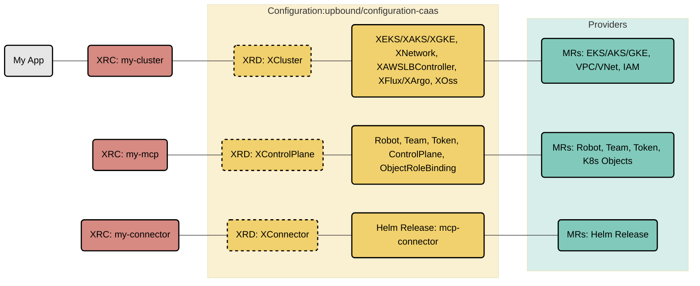

# Cluster-as-a-Service Configuration

This repository contains a multi-cloud Cluster-as-a-Service Platform Configuration for
[Crossplane](https://crossplane.io/) built with [Upbound DevEx](https://docs.upbound.io/devex/). It's a great starting point for building
internal cloud platforms that span AWS, Azure, and GCP, and offer a self-service API to your internal
development teams.

This platform offers APIs for setting up fully configured Kubernetes clusters (EKS, AKS, GKE)
with secure networking, GitOps integration (Flux or ArgoCD), observability stacks, and
Upbound Managed Control Planes with mcp-connector for cluster management. All components are built using
cloud service providers from the [Official Upbound Provider Families](https://marketplace.upbound.io/).

## Architecture

This platform uses **Upbound DevEx** with:
- **Embedded KCL Functions**: Pipeline-mode compositions with embedded KCL functions instead of external patch-and-transform
- **Test-Driven Development**: Comprehensive composition tests and e2e tests for all APIs
- **Strong Typing**: KCL models for type-safe resource definitions
- **Modern Workflow**: `up project build`, `up test run`, and `up composition render` commands

## Overview

This reference platform provides three specialized APIs:

### XCluster - Multi-Cloud Kubernetes Clusters

The [XCluster](apis/definition.yaml) API provisions fully configured Kubernetes clusters across AWS (EKS), Azure (AKS), and GCP (GKE), incorporating XRs from these configurations:

* [upbound-configuration-aws-network](https://github.com/upbound/configuration-aws-network)
* [upbound-configuration-aws-eks](https://github.com/upbound/configuration-aws-eks)
* [upbound-configuration-aws-lb-controller](https://github.com/upbound/configuration-aws-lb-controller)
* [upbound-configuration-azure-network](https://github.com/upbound/configuration-azure-network)
* [upbound-configuration-azure-aks](https://github.com/upbound/configuration-azure-aks)
* [upbound-configuration-gcp-network](https://github.com/upbound/configuration-gcp-network)
* [upbound-configuration-gcp-gke](https://github.com/upbound/configuration-gcp-gke)
* [upbound-configuration-observability-oss](https://github.com/upbound/configuration-observability-oss)
* [upbound-configuration-gitops-flux](https://github.com/upbound/configuration-gitops-flux)
* [upbound-configuration-gitops-argocd](https://github.com/upbound/configuration-gitops-argocd)

### XControlPlane - Upbound Managed Control Planes

The [XControlPlane](apis/upbound/controlplane/definition.yaml) API provisions Upbound Managed Control Planes (MCPs) in Upbound Spaces with:
- Robot and Team management for RBAC
- Automatic token generation for mcp-connector
- Group-level namespace access configuration
- Connection secret with kubeconfig and token

### XConnector - MCP Connector

The [XConnector](apis/upbound/mcp-connector/definition.yaml) API installs mcp-connector helm chart to connect spoke clusters to Upbound MCPs with:
- Automatic token reference from XControlPlane
- Configurable connector version
- Namespace and cluster identification



Learn more about Composite Resources in the [Crossplane
Docs](https://docs.crossplane.io/latest/concepts/compositions/).

## Quickstart

### Installation

Install this configuration from the [Upbound Marketplace](https://marketplace.upbound.io/configurations/upbound/configuration-caas/):

```console
up ctp configuration install xpkg.upbound.io/upbound/configuration-caas:latest
```

### Development Workflow

This platform uses **Upbound DevEx** for modern development:

```console
# Build the project and compile KCL functions
up project build

# Run composition tests
up test run tests/*

# Render compositions with examples
up composition render apis/definition.yaml apis/composition.yaml examples/cluster-aws-flux.yaml
```

## Using the Platform

Once installed, you can create platform resources using the provided examples:

### Creating a Kubernetes Cluster

```console
# Create an AWS EKS cluster with Flux GitOps
kubectl apply -f examples/cluster-aws-flux.yaml

# Create an Azure AKS cluster with ArgoCD
kubectl apply -f examples/cluster-azure-argocd.yaml

# Create a GCP GKE cluster with Flux
kubectl apply -f examples/cluster-gcp-flux.yaml
```

### Creating an Upbound Managed Control Plane

```console
# Create an MCP in Upbound Spaces
kubectl apply -f examples/upbound-controlplane.yaml

# This creates:
# - Control Plane in the specified Upbound Space group
# - Robot for programmatic access
# - Team for RBAC
# - Robot Token for mcp-connector
# - Connection secret with kubeconfig and token
```

### Connecting a Cluster to an MCP

```console
# Install mcp-connector to connect a cluster to the MCP
kubectl apply -f examples/upbound-mcp-connector.yaml

# The connector uses the token from the XControlPlane's connection secret
```

Monitor deployment status:

```console
kubectl get claim,composite,managed
```

You can also use the Crossplane CLI for detailed status:

```console
crossplane beta trace cluster.caas.upbound.io/my-cluster
crossplane beta trace xcontrolplanes.mcp.caas.upbound.io/my-mcp
```

## Development

### Testing

```console
# Run all composition tests
up test run tests/*

# Run specific composition test
up test run tests/test-xcluster-aws-flux

# Run end-to-end tests (requires cloud credentials)
up test run tests/e2etest-xcluster-aws --e2e
up test run tests/e2etest-xcontrolplane --e2e
up test run tests/e2etest-xconnector --e2e
```

### Building and Publishing

```console
# Build the project
up project build

# Deploy locally to a control plane
up project run
```

For publishing to the marketplace, see the [Upbound documentation](https://docs.upbound.io/devex/).

## Platform Features

This reference platform includes several key features:

### Multi-Cloud Support
- Single API for provisioning clusters across AWS (EKS), Azure (AKS), and GCP (GKE)
- Cloud-specific optimizations (AWS Load Balancer Controller, IAM roles, etc.)
- Consistent networking setup across providers

### GitOps Integration
- Choice of Flux or ArgoCD as GitOps operator
- Automatic operator installation and configuration
- Git repository synchronization for application deployments

### Observability
- Prometheus stack automatically deployed
- Metrics collection and monitoring configured
- Integration with cloud-native observability tools

### Intelligent Resource Ordering
- Network resources created first
- Clusters provisioned after networking
- GitOps and observability deployed after cluster readiness
- Conditional resource creation to avoid race conditions

### Upbound Managed Control Planes
- Automated MCP provisioning in Upbound Spaces
- Robot and Team management for secure access
- Token generation for mcp-connector
- Group-level namespace access control
- Team resources use Orphan deletion policy to preserve teams

### MCP Connector
- Helm-based connector installation
- Token reference from XControlPlane connection secrets
- Configurable connector version
- Automatic cluster registration with MCP

### Enhanced Resilience
- Extended timeouts for GitOps deployments
- Conditional resource creation based on readiness status
- Proper usage dependencies for deletion ordering
- Connection secret propagation for secure credentials

## Available APIs

### Cluster API

- [`Cluster.caas.upbound.io`](apis/definition.yaml) - Provision/Manage EKS, AKS, or GKE clusters

**Parameters:**
- `cloud`: Cloud provider (aws, azure, gcp)
- `region`: Deployment region
- `version`: Kubernetes version
- `nodes`: Node pool configuration (count, instanceType)
- `gitops`: GitOps configuration (operator, git repository)
- `operators`: Operator versions (flux, argocd, prometheus)

### ControlPlane API

- [`ControlPlane.mcp.caas.upbound.io`](apis/upbound/controlplane/definition.yaml) - Provision/Manage Upbound MCPs

**Parameters:**
- `organizationName`: Upbound organization name
- `spaceHost`: Upbound Space host URL
- `groupName`: Group (namespace) where the control plane will be created
- `configuration`: Configuration name
- `robotPermission`: Robot permission level (owner, admin, etc.)

**Writes Connection Secret with:**
- `kubeconfig`: MCP kubeconfig for API access
- `token`: Robot token for mcp-connector

### Connector API

- [`Connector.mcp.caas.upbound.io`](apis/upbound/mcp-connector/definition.yaml) - Provision/Manage MCP Connectors

**Parameters:**
- `organizationName`: Upbound organization name
- `controlPlaneName`: MCP name to connect to
- `version`: mcp-connector version
- `providerConfigName`: Provider-helm ProviderConfig name (cluster's provider config)
- `tokenSecretRef`: Reference to XControlPlane's connection secret

## Migration to DevEx

This configuration has been migrated to **Upbound DevEx v2alpha1** with embedded KCL functions:

### Completed Migrations
✅ **XControlPlane** - Fully migrated with embedded KCL function
- Robot, Team, and Token management
- ControlPlane creation in Upbound Spaces
- Group-level ProviderConfig setup
- Connection secret with kubeconfig and token

✅ **XConnector** - Fully migrated with embedded KCL function
- Helm Release for mcp-connector
- Token reference from XControlPlane
- Configurable version and namespace

✅ **XCluster** - Fully migrated with embedded KCL function
- Multi-cloud cluster provisioning (AWS/Azure/GCP)
- Network, cluster, and add-on composition
- GitOps and observability integration

### Testing Coverage
- **Composition Tests**: All APIs have composition tests (`tests/test-*`)
- **E2E Tests**: Full end-to-end deployment tests for AWS, Azure, GCP clusters and MCP provisioning (`tests/e2etest-*`)

### Benefits of DevEx Migration
- Reduced complexity: Single embedded function per API vs multiple pipeline steps
- Better type safety: KCL type checking and validation
- Improved testability: Fast composition tests without external function dependencies
- Easier debugging: All logic in one place with clear data flow
- Better performance: No external function communication overhead

## GitOps Integration

Cluster-as-a-Service deployments work best when managed in your infrastructure as code
lifecycle.

For more information on how to integrate Argo CD and Flux in your Upbound
environment, check out the [GitOps with Control Planes doc](https://docs.upbound.io/mcp/gitops/).

## Next Steps

- Explore the [examples](examples/) directory for usage patterns
- Check out the [Upbound DevEx documentation](https://docs.upbound.io/devex/) for advanced features
- Review the [KCL functions](functions/) for customization
- Join the [Crossplane Slack](https://slack.crossplane.io) community

## Contributing

If you encounter issues or want to request improvements, review the
[Contributing Guides](https://docs.crossplane.io/contribute/).
